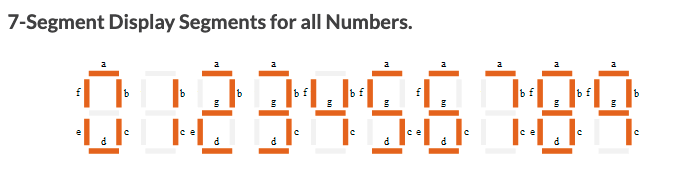
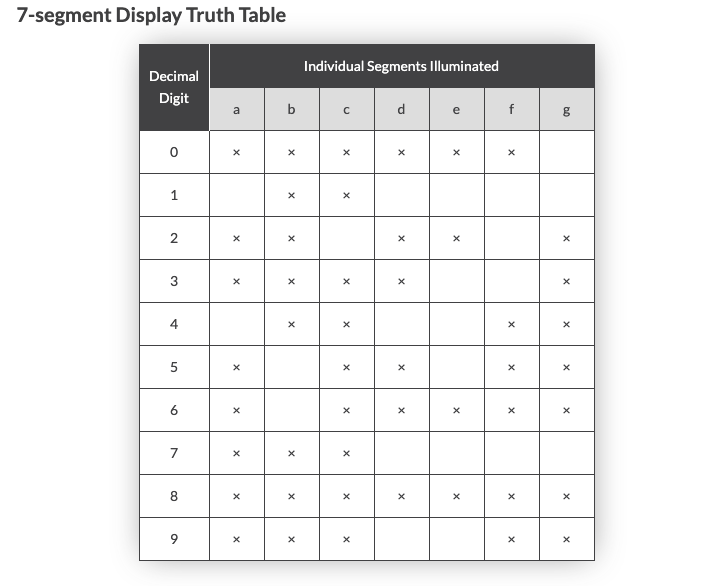

# Invoice Digitizer

The following project provides the conversion solution for 7-segment display representations to regular number 

# Design Overview

The solution could be easily be extended by custom data provider and exporter to be integrated into distrubited scale architecture.

# 7-Segment converter implementation details  

The conversion algorithm is based on the following segment to latter mapping 
the idea is to iterate through the set of lines and covert each segment to corresponding set of letters

   ```java 
    private static final String leftSegment = "|_ ";
    private static final String rightSegment = " _|";
    private static final String rightAndLeftSegment = "|_|";
    private static final String twoSegments = "| |";
    private static final String oneSegment = "_";
    private static final String oneLeftSegment = "|  ";
    private static final String oneRightSegment = "  |";
   ```



Latter all converted segments are joined together and validated if there is a mapping value from the 
following table, if yes the number is found otherwise we have a typo on the number,
a segment is missing or redundant  




# Java doc